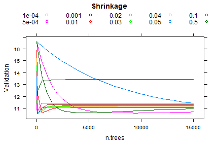
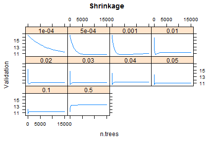

## Introduction to Gradient Boosting


- GBM (Gradient Boosting Machines) is a machine learning algorithm that allows to learn models from data.

- GBM is available in an R-package called [gbm](http://cran.r-project.org/web/packages/gbm/index.html)

- Typical GBM models are ensembles of trees

- In order for GBM to have good performance, several parameters must be tuned. In particular, **n.trees** (number of trees), **shrinkage** (learning rate), tree-depth (**interaction-depth**), or **n.minobsinnode** (number of instances in the tree leaves). Visualizing for every parameter, how validation error changes as the number of trees increases, can help in understanding and selecting the best combination of parameters.

--- .class #id 

## Aim of the shiny application

- A file with gbm validation results for [predicting Algae Blooms](http://www.dcc.fc.up.pt/~ltorgo/DataMiningWithR/datasets2.html) has been previously generated for all possible combinations of values of the following parameters:


```
## $interaction.depth
##  [1]  1  2  3  4  5  6  8 10 12 14
## 
## $shrinkage
##  [1] 1e-04 5e-04 1e-03 1e-02 2e-02 3e-02 4e-02 5e-02 1e-01 5e-01
## 
## $n.minobsinnode
##  [1]  2  3  4  5  6  7  8  9 10 11 12 13 14 15 20 25 30
## 
## $n.trees
##  [1]    10    20    30    40    50    60    70    80    90   100   500
## [12]  1000  1500  2000  2500  3000  3500  4000  4500  5000  5500  6000
## [23]  6500  7000  7500  8000  8500  9000  9500 10000 10500 11000 11500
## [34] 12000 12500 13000 13500 14000 14500 15000
```


--- .class #id 

## Aim of the shiny application

- The purpose of the application is to visualize validation error vs. number of trees for every parameter. The user can select one parameter from interactive.depth, shrinkage, and n.minobsinnode. The user can choose to visualize in the same plot all values of the selected parameter, by choosing Outer=FALSE, or in different plots, by selecting Outer=TRUE. Below there is an example for shrinkage with Outer=FALSE:


```r
        res = ddply(results, c("n.trees","shrinkage"), summarize, Validation=min(Validation))
        xyplot(Validation ~ n.trees, groups=factor(shrinkage), res, 
               main="Shrinkage", type="l", as.table=TRUE, outer=FALSE, auto.key=list(columns=5))
```

 

--- .class #id 

## Aim of the shiny application

- Here there is an example with Outer=TRUE


```r
        res = ddply(results, c("n.trees","shrinkage"), summarize, Validation=min(Validation))
        xyplot(Validation ~ n.trees|factor(shrinkage), res, 
               main="Shrinkage", type="l", as.table=TRUE, outer=FALSE, auto.key=TRUE)
```

 
 

